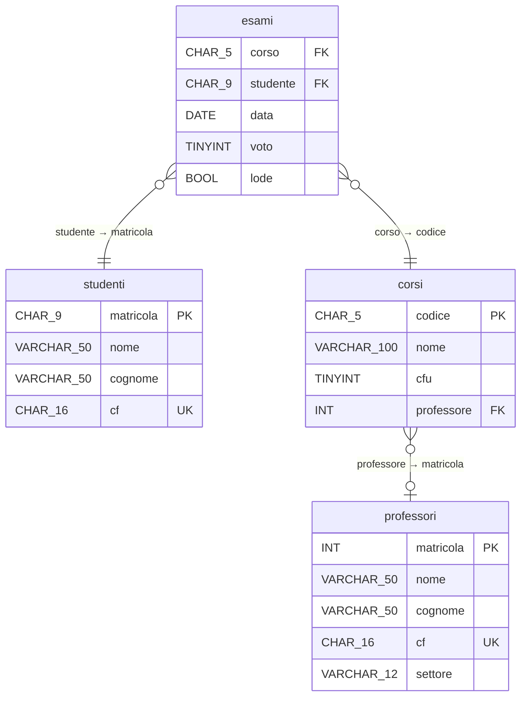

```mermaid
erDiagram
    studenti {
        CHAR_9 matricola PK
        VARCHAR_50 nome
        VARCHAR_50 cognome
        CHAR_16 cf UK
    }
    professori {
        INT matricola PK
        VARCHAR_50 nome
        VARCHAR_50 cognome
        CHAR_16 cf UK
        VARCHAR_12 settore
    }
    corsi {
        CHAR_5 codice PK
        VARCHAR_100 nome
        TINYINT cfu
        INT professore FK
    }
    esami {
        CHAR_5 corso FK
        CHAR_9 studente FK
        DATE data
        TINYINT voto
        BOOL lode
    }

    corsi }o--o| professori : "professore → matricola"
    esami }o--|| corsi : "corso → codice"
    esami }o--|| studenti : "studente → matricola"
```
