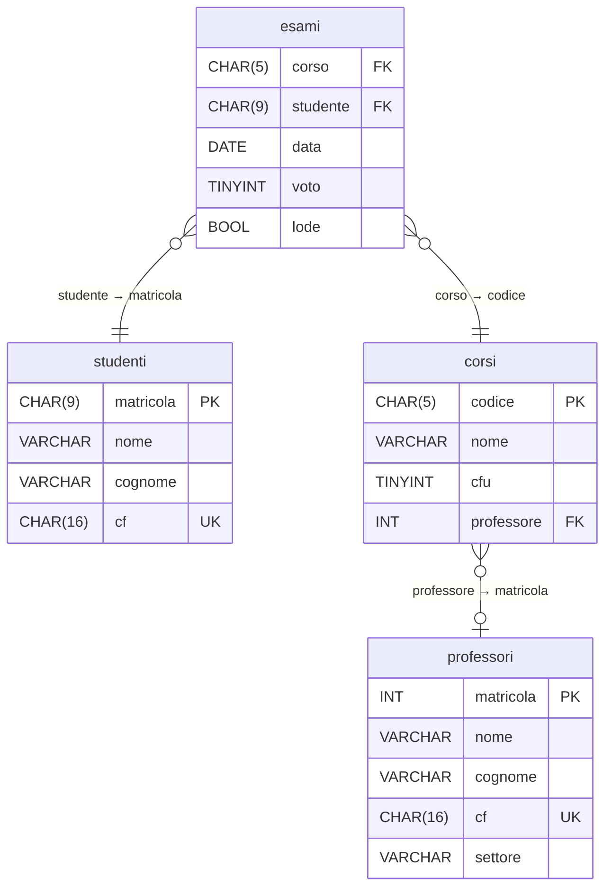

```mermaid
erDiagram
    studenti {
        CHAR(9) matricola PK
        VARCHAR nome
        VARCHAR cognome
        CHAR(16) cf UK
    }
    professori {
        INT matricola PK
        VARCHAR nome
        VARCHAR cognome
        CHAR(16) cf UK
        VARCHAR settore
    }
    corsi {
        CHAR(5) codice PK
        VARCHAR nome
        TINYINT cfu
        INT professore FK
    }
    esami {
        CHAR(5) corso FK
        CHAR(9) studente FK
        DATE data
        TINYINT voto
        BOOL lode
    }

    corsi }o--o| professori : "professore → matricola"
    esami }o--|| corsi : "corso → codice"
    esami }o--|| studenti : "studente → matricola"
```
